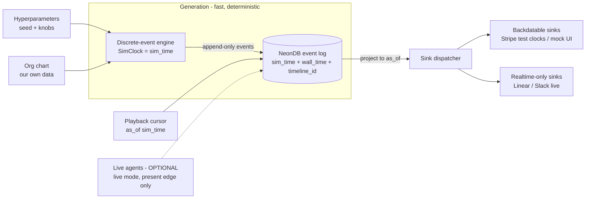

# CLAUDE.md

This file provides guidance to Claude Code (claude.ai/code) when working with code in this repository.

## Status: greenfield

This repo is empty (no commits, no code yet). This document captures the **intended design** so future instances can scaffold consistently. When you add real build/test/run commands, replace the "Bootstrapping" placeholders below with the actual invocations — don't leave aspirational commands that don't run.

## What this is

A **long-running simulation of the Pied Piper company** (HBO *Silicon Valley*). It continuously emits realistic-but-mocked operational data — Slack messages, Linear issues, Stripe charges/subscriptions, etc. — so we can **demo our own products against a living dataset** instead of static fixtures. The company is modeled by a **deterministic event generator**; the org chart is our own data, not an external system. (Real AI agents are an *optional* live-mode add-on, never a dependency — see §5 and [ADR-0001](docs/adr/0001-deterministic-generator-core-drop-paperclip.md).)

Three hard requirements shape every design decision:

1. **Virtual time / speed-up** — the sim runs on a virtual clock so we can compress months into hours (e.g. many "monthly retros" in an afternoon). See §1–§2.
2. **Time travel** — showcase the company *as it was at any past `sim_time`* (e.g. "Pied Piper at seed stage" vs. "after the platform pivot"). The central constraint: make "reconstruct state at T" cheap and exact.
3. **Long-running & cheap** — emit events indefinitely at near-zero marginal cost. This is why the core is a deterministic generator, not real-time LLM agents.

## Core architecture

### 1. Virtual time & the three clocks (the spine of speed-up + time travel)

The simulation runs on **virtual time**, decoupled from wall-clock, so we can compress months into hours (e.g. watch many "monthly retros" in an afternoon) and jump to any past point. Never conflate these three clocks:

- **`sim_time`** (virtual) — the in-world clock and the **canonical timestamp on every event**. Drives all domain logic, event cadence, and time travel.
- **`wall_time`** (real) — when the event was actually produced/recorded. For debugging/observability only.
- **external service time** — the `created_at` Linear/Stripe/Slack assign on push. Reconciled via a mapping; never trusted as truth (see §6).

**Hard rule:** domain code reads `sim_time` from a `SimClock` service (an Effect `Layer` you can swap — the `Clock`/`TestClock` pattern), never `Date.now()` or Postgres `now()`. This single rule is what makes both speed-up and time travel work.

### 2. Discrete-event engine + generation/playback split

- **Discrete-event scheduling, not fixed ticks.** Future events are enqueued at their `sim_time` in a priority queue; the clock *jumps* to the next event, skipping idle intervals (nights/weekends). A "monthly retrospective" is a recurring event on month boundaries. "Many retros in a few hours" falls out for free — we hop between things that happen, not simulate idle time. A `time_scale` factor (e.g. 720× = 1 sim-month/real-hour) only matters to *throttle* playback to a watchable pace.
- **Separate generation from playback.** Generation runs ahead and writes the deterministic event log fast. Playback is a **cursor** over `sim_time`: time travel = move the cursor; speed-up = advance it faster. Generate once, demo many times, at any point and any speed — without re-running the sim.

### 3. Event-sourced timeline

State is **derived**, never the source of truth. Any view (org, finances, Slack history, deal pipeline) is a **projection** folding events up to a chosen `as_of` (a `sim_time`).

- Time travel = project events `WHERE sim_time <= :as_of`. Thread `as_of` through the whole read path.
- **Branching timelines** — a `timeline_id` on every event so demo narratives diverge from a shared past without mutating each other.
- **Snapshots** (materialized projection at checkpoint `sim_time`s) are an optimization only — always rederivable from the log.
- Events are immutable and append-only: corrections are new compensating events, never UPDATE/DELETE of history. (This append-only shape is also what keeps a future Delta/lakehouse export clean — see Backend.)

### 4. Hyperparameters

A single declarative config defines the "shape" of the simulation — growth rate, burn rate, headcount curve, churn, deal velocity, incident frequency, "drama level", etc. Combined with a fixed **random seed**, a given hyperparameter set must produce a **deterministic** event stream (so demos are reproducible and re-runnable). Treat seed + hyperparameters as the reproducibility contract; avoid non-seeded randomness, wall-clock reads, or unordered map iteration in event generation.

### 5. Org chart & the role of agents

The Pied Piper org (Richard/CEO, Gilfoyle, Dinesh, Jared, …) is **our own data** — roles, reporting structure, headcount over `sim_time` — owned in NeonDB and consumed by the generator. We do **not** delegate this to an external orchestrator. Per [ADR-0001](docs/adr/0001-deterministic-generator-core-drop-paperclip.md), real-time LLM agents (e.g. [Paperclip](https://paperclip.ing/)) are **dropped from the critical path** — they conflict with virtual time, determinism, and cost.

Agents may appear in exactly two ways, neither a dependency of generation or time travel:

- **Live mode (optional, additive).** At the *present edge only*, at real pace, real agents may react to the simulated world for demos where "agentic company" is the point. They must not drive compressed/historical generation — that reintroduces the wall-clock-vs-virtual-time conflict.
- **Offline authoring (optional).** LLMs may author flavor content (Slack threads, retro notes in character) *during generation*, with output **cached keyed by event id** so determinism and replay hold. The hot path reads the cache, never the model.

Baseline to ship first: rules / templates / seeded statistical models — no LLMs at all.

### 6. Integration sinks — classify by *time capability*

Each sink is a swappable adapter (ports & adapters) that takes "company state as of `sim_time` T" and renders it into a provider's format. The hard part is that external SaaS assign their own `created_at` and mostly can't be backdated — so don't pretend they can. Every sink **declares its time capability**, and the dispatcher honors it:

- **Backdatable / clock-controllable → faithful virtual time:**
  - **Stripe → use [Test Clocks](https://docs.stripe.com/billing/testing/test-clocks).** Purpose-built for this: attach customers/subscriptions to a test clock and *advance the clock* to fast-forward billing cycles, renewals, invoices, dunning. Map `sim_time` ↔ test-clock time and advance in lockstep.
  - **Our own mock UI / local emulators** — we own the timestamp. Best surface for historical reconstruction and time travel.
- **Append-only realtime (can only ever show "now") → Linear, Slack live APIs:**
  - Their `created_at` = wall time of the push; you **cannot** rebuild compressed history inside them faithfully.
  - Carry `sim_time` as **metadata** (Linear labels/custom fields like `Sim: 2024-03`, Slack message prefix, Stripe `metadata.sim_time`) so the canonical clock travels with the record.
  - Use live APIs for **"now-forward" live demos** (cursor at the present edge, replayed at a watchable `time_scale`). Render **historical / time-travel** views from the mock surface, not a real workspace.

**Replay safety (mandatory):** because we time-travel and re-run timelines, every external push must be **idempotent** — derive the idempotency key deterministically from `(event_id, timeline_id)`. Stripe has native idempotency keys; for Linear/Slack, look up by `sim_time` metadata before creating. Otherwise a re-run duplicates customers and issues.

## Backend: NeonDB

Serverless Postgres ([Neon](https://neon.com/)). Two Neon features map directly onto our requirements — confirm before relying on them, but design with them in mind:

- **Branching** — Neon database branches are a natural fit for branching demo timelines and for "fork prod state, run an experiment" workflows.
- **Point-in-time / instant restore** — complements (does not replace) our event-sourced time travel; our `as_of` projection is the application-level mechanism, Neon branching is the infra-level one.

Keep migrations in-repo and forward-only. Connection strings and provider secrets (Stripe, Slack, Linear) are env-injected, never committed.

**Analytical capture (optional, not yet on the critical path).** NeonDB is the OLTP system of record. A DuckDB + [Delta + Unity Catalog](https://duckdb.org/2026/05/07/delta-uc-updates) lakehouse is a good *downstream* capture/export sink to add later — for analytics demos or cheap long-term retention of an ever-growing stream. Our append-only event log is a clean fit for Delta's `INSERT`-only writes (we never UPDATE/DELETE history). Caveat: Delta's `AT (VERSION => N)` time travel is by *commit version* (write order), **not** our business `sim_time` — it's a separate operational axis, not a replacement for §3's `as_of` projection. To keep this door open now, just keep the event schema stable and self-describing (`sim_time`, `timeline_id`, typed `TaggedClass` events).

## Conventions (inherited from workspace)

This repo lives under the FractalBox workspace; the root `CLAUDE.md` / `AGENTS.md` rules apply. Most load-bearing here:

- **TypeScript + Effect-TS** primary stack. Model domain events as `Schema.TaggedClass`, errors as `Schema.TaggedError`; branch with `Match.tag` + `Match.exhaustive` and `Effect.catchTag` — never touch `._tag` directly (except `Schedule` predicates). Wire adapters (sinks, repos) via Layers, not a runtime DI container.
- **Hexagonal architecture** — pure simulation/domain core; Slack/Linear/Stripe/Neon (and any optional live-mode agents) are adapters at the edge.
- **Feature branches only** — never commit to `main`. `git checkout -b` before committing; open PRs as **draft** until CI is green and rebased.
- **No absolute local paths** in committed code, PRs, or anything pushed to GitHub — use repo-relative paths.
- GitHub remote: `fractalboxdev/pied-piper-simulation`.

## Bootstrapping (fill in as the project takes shape)

No toolchain is committed yet. When scaffolding, the likely shape is a TypeScript/Effect project (pnpm). Record the real commands here once they exist — e.g. `pnpm install`, `pnpm test`, `pnpm test <file>` for a single test, `pnpm dev`/the long-running sim entrypoint, and the DB migration command. Until then, there is nothing to build or test.
