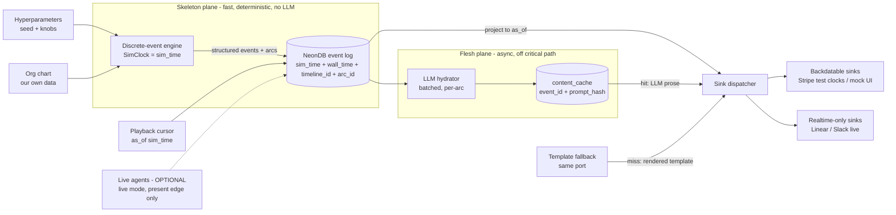

# CLAUDE.md

This file provides guidance to Claude Code (claude.ai/code) when working with code in this repository.

## Status: early scaffold

This repo holds the design docs (ADRs), the [persona cards](PERSONAS.md), and a minimal pnpm/TypeScript toolchain with the Slack persona seeding script — the simulation engine itself is not built yet. This document captures the **intended design** so future instances can scaffold consistently. When you add real build/test/run commands, record them in "Bootstrapping" below — don't leave aspirational commands that don't run.

## What this is

A **long-running simulation of the Pied Piper company** (HBO *Silicon Valley*). It continuously emits realistic-but-mocked operational data — Slack messages, Linear issues, Stripe charges/subscriptions, etc. — so we can **demo our own products against a living dataset** instead of static fixtures. The company is modeled by a **deterministic event generator**; the org chart is our own data, not an external system. Realistic prose comes from an **async LLM hydrator off the critical path** (see §5 and [ADR-0002](docs/adr/0002-skeleton-flesh-hydration.md)); real AI agents are an *optional* live-mode add-on, never a dependency (see §6 and [ADR-0001](docs/adr/0001-deterministic-generator-core-drop-paperclip.md)).

Three hard requirements shape every design decision:

1. **Virtual time / speed-up** — the sim runs on a virtual clock so we can compress months into hours (e.g. many "monthly retros" in an afternoon). See §1–§2.
2. **Time travel** — showcase the company *as it was at any past `sim_time`* (e.g. "Pied Piper at seed stage" vs. "after the platform pivot"). The central constraint: make "reconstruct state at T" cheap and exact.
3. **Long-running & cheap** — emit events indefinitely at near-zero marginal cost. This is why the core is a deterministic generator, not real-time LLM agents.

## Core architecture

### 1. Virtual time & the three clocks (the spine of speed-up + time travel)

The simulation runs on **virtual time**, decoupled from wall-clock, so we can compress months into hours (e.g. watch many "monthly retros" in an afternoon) and jump to any past point. Never conflate these three clocks:

- **`sim_time`** (virtual) — the in-world clock and the **canonical timestamp on every event**. Drives all domain logic, event cadence, and time travel.
- **`wall_time`** (real) — when the event was actually produced/recorded. For debugging/observability only.
- **external service time** — the `created_at` Linear/Stripe/Slack assign on push. Reconciled via a mapping; never trusted as truth (see §7).

**Hard rule:** domain code reads `sim_time` from a `SimClock` service (an Effect `Layer` you can swap — the `Clock`/`TestClock` pattern), never `Date.now()` or Postgres `now()`. This single rule is what makes both speed-up and time travel work.

### 2. Discrete-event engine + generation/playback split

- **Discrete-event scheduling, not fixed ticks.** Future events are enqueued at their `sim_time` in a priority queue; the clock *jumps* to the next event, skipping idle intervals (nights/weekends). A "monthly retrospective" is a recurring event on month boundaries. "Many retros in a few hours" falls out for free — we hop between things that happen, not simulate idle time. A `time_scale` factor (e.g. 720× = 1 sim-month/real-hour) only matters to *throttle* playback to a watchable pace.
- **Separate generation from playback.** Generation runs ahead and writes the deterministic event log fast. Playback is a **cursor** over `sim_time`: time travel = move the cursor; speed-up = advance it faster. Generate once, demo many times, at any point and any speed — without re-running the sim.

### 3. Event-sourced timeline

State is **derived**, never the source of truth. Any view (org, finances, Slack history, deal pipeline) is a **projection** folding events up to a chosen `as_of` (a `sim_time`).

- Time travel = project events `WHERE sim_time <= :as_of`. Thread `as_of` through the whole read path.
- **Branching timelines** — a `timeline_id` on every event so demo narratives diverge from a shared past without mutating each other.
- **Snapshots** (materialized projection at checkpoint `sim_time`s) are an optimization only — always rederivable from the log.
- Events are immutable and append-only: corrections are new compensating events, never UPDATE/DELETE of history. (This append-only shape is also what keeps a future Delta/lakehouse export clean — see Backend.)

### 4. Hyperparameters

A single declarative config defines the "shape" of the simulation — growth rate, burn rate, headcount curve, churn, deal velocity, incident frequency, "drama level", etc. Combined with a fixed **random seed**, a given hyperparameter set must produce a **deterministic** event stream (so demos are reproducible and re-runnable). Treat seed + hyperparameters as the reproducibility contract; avoid non-seeded randomness, wall-clock reads, or unordered map iteration in event generation.

### 5. LLM realism — skeleton/flesh split & async hydration

How we get LLM-quality prose without ever putting an LLM on the fast-forward path ([ADR-0002](docs/adr/0002-skeleton-flesh-hydration.md)). Every event is split across two planes:

- **Skeleton (deterministic, fast).** The engine emits fully **structured** events — actor, type, intent, sentiment, magnitude, refs (e.g. `SlackMessagePosted { author: "gilfoyle", channel: "#infra", arcId: "incident-42", intent: "deflect-blame", sentiment: "snarky" }`). Everything projections, sinks, and downstream events need lives here; generation stays pure `seed + hyperparams → events`, years in seconds.
- **Flesh (LLM, async, cached).** A **hydrator** worker renders skeleton events into realistic prose (Slack bodies, Linear descriptions, retro docs), cached keyed by `(timeline_id, event_id, prompt_hash)`. It prioritizes the window around the playback cursor — hydrate what the audience is about to see — and never blocks generation or playback.

**The load-bearing invariant: prose is never load-bearing.** No event may depend on the *text* of another event — only on structured skeleton fields. If a future event must "react to what Gilfoyle said", encode the reaction-relevant bit as a skeleton field (`intent`, `outcome`, `decision`); the hydrator honors it, never the reverse. Violating this puts the model back in the generation loop and collapses ADR-0001's guarantees. Enforce mechanically: the hydrator is the only writer to `content_cache`, and the projection/read path has no LLM client in its Layer graph.

Key mechanics (details in ADR-0002):

- **Arcs are the unit of hydration.** Related events are grouped into narrative **arcs** (`arc_id`): incident → Slack thread → Linear issue → postmortem. One arc per LLM call ⇒ coherent threads (message 3 knows what message 2 said).
- **Prompts are pure functions of the log** — versioned in-repo **persona cards** ([PERSONAS.md](PERSONAS.md): Richard, Gilfoyle, Jared, …) + the arc's structured beats + a bounded world-state digest (the projection at the arc's start `sim_time`). Pure inputs make `prompt_hash` a stable cache key; better prompts auto-invalidate exactly the affected entries.
- **Template fallback on cache miss.** The LLM author and the template author implement the **same port**; playback degrades from "great prose" to "fine prose", never blocks. The no-LLM baseline (ship first, per ADR-0001) *is* the fallback path.
- **Two determinism tiers.** Default: structural — event stream bit-identical; prose may differ if regenerated cold. Opt-in for canned demos: full — snapshot the populated cache with the timeline; replay reads cache only.
- **Cost.** Hydration is async ⇒ Anthropic Batch API by default; model tier per arc importance (small for chatter, large for board meetings/incidents/retros); `tokens_per_sim_month` budget knob. Hydrate once, replay forever. Forked timelines share the parent's cache for the common event prefix.

### 6. Org chart & the role of agents

The Pied Piper org (Richard/CEO, Gilfoyle, Dinesh, Jared, …) is **our own data** — roles, reporting structure, headcount over `sim_time` — owned in NeonDB and consumed by the generator. We do **not** delegate this to an external orchestrator. Per [ADR-0001](docs/adr/0001-deterministic-generator-core-drop-paperclip.md), real-time LLM agents (e.g. [Paperclip](https://paperclip.ing/)) are **dropped from the critical path** — they conflict with virtual time, determinism, and cost.

Agents may appear in exactly two ways, neither a dependency of generation or time travel:

- **Live mode (optional, additive).** At the *present edge only*, at real pace, real agents may react to the simulated world for demos where "agentic company" is the point. They must not drive compressed/historical generation — that reintroduces the wall-clock-vs-virtual-time conflict.
- **Offline authoring (optional).** LLMs may author flavor content (Slack threads, retro notes in character), with output **cached keyed by event id** so determinism and replay hold. The hot path reads the cache, never the model. This is the §5 hydrator — see [ADR-0002](docs/adr/0002-skeleton-flesh-hydration.md) for the full design.

Baseline to ship first: rules / templates / seeded statistical models — no LLMs at all. (Per §5 this baseline doubles as the hydration fallback, so it's never throwaway work.)

### 7. Integration sinks — classify by *time capability*

Each sink is a swappable adapter (ports & adapters) that takes "company state as of `sim_time` T" and renders it into a provider's format. The hard part is that external SaaS assign their own `created_at` and mostly can't be backdated — so don't pretend they can. Every sink **declares its time capability**, and the dispatcher honors it:

- **Backdatable / clock-controllable → faithful virtual time:**
  - **Stripe → use [Test Clocks](https://docs.stripe.com/billing/testing/test-clocks).** Purpose-built for this: attach customers/subscriptions to a test clock and *advance the clock* to fast-forward billing cycles, renewals, invoices, dunning. Map `sim_time` ↔ test-clock time and advance in lockstep.
  - **PostHog → quasi-backdatable:** the capture/batch API accepts historical `timestamp`s (send `historical_migration: true` for old events) and a client-supplied deterministic `uuid` for replay dedupe — see `scripts/posthog/seed-fixtures.ts`.
  - **Our own mock UI / local emulators** — we own the timestamp. Best surface for historical reconstruction and time travel.
- **Append-only realtime (can only ever show "now") → Linear, Slack live APIs, HubSpot:**
  - **HubSpot:** system `createdate` is server-assigned; carry `sim_time` (+ `sim_event_id`, `timeline_id`) as custom properties and idempote via CRM search on `sim_event_id` — see `scripts/hubspot/seed-fixtures.ts`.
  - Their `created_at` = wall time of the push; you **cannot** rebuild compressed history inside them faithfully.
  - Carry `sim_time` as **metadata** (Linear labels/custom fields like `Sim: 2024-03`, Slack message prefix, Stripe `metadata.sim_time`) so the canonical clock travels with the record.
  - Use live APIs for **"now-forward" live demos** (cursor at the present edge, replayed at a watchable `time_scale`). Render **historical / time-travel** views from the mock surface, not a real workspace.

**Replay safety (mandatory):** because we time-travel and re-run timelines, every external push must be **idempotent** — derive the idempotency key deterministically from `(event_id, timeline_id)`. Stripe has native idempotency keys; for Linear/Slack, look up by `sim_time` metadata before creating. Otherwise a re-run duplicates customers and issues.

## Backend: NeonDB

Serverless Postgres ([Neon](https://neon.com/)). Two Neon features map directly onto our requirements — confirm before relying on them, but design with them in mind:

- **Branching** — Neon database branches are a natural fit for branching demo timelines and for "fork prod state, run an experiment" workflows.
- **Point-in-time / instant restore** — complements (does not replace) our event-sourced time travel; our `as_of` projection is the application-level mechanism, Neon branching is the infra-level one.

Keep migrations in-repo and forward-only. Connection strings and provider secrets (Stripe, Slack, Linear) are env-injected, never committed.

**Analytical capture (optional, not yet on the critical path).** NeonDB is the OLTP system of record. A DuckDB + [Delta + Unity Catalog](https://duckdb.org/2026/05/07/delta-uc-updates) lakehouse is a good *downstream* capture/export sink to add later — for analytics demos or cheap long-term retention of an ever-growing stream. Our append-only event log is a clean fit for Delta's `INSERT`-only writes (we never UPDATE/DELETE history). Caveat: Delta's `AT (VERSION => N)` time travel is by *commit version* (write order), **not** our business `sim_time` — it's a separate operational axis, not a replacement for §3's `as_of` projection. To keep this door open now, just keep the event schema stable and self-describing (`sim_time`, `timeline_id`, typed `TaggedClass` events).

## Conventions (inherited from workspace)

This repo lives under the FractalBox workspace; the root `CLAUDE.md` / `AGENTS.md` rules apply. Most load-bearing here:

- **TypeScript + Effect-TS** primary stack. Model domain events as `Schema.TaggedClass`, errors as `Schema.TaggedError`; branch with `Match.tag` + `Match.exhaustive` and `Effect.catchTag` — never touch `._tag` directly (except `Schedule` predicates). Wire adapters (sinks, repos) via Layers, not a runtime DI container.
- **Hexagonal architecture** — pure simulation/domain core; Slack/Linear/Stripe/Neon (and any optional live-mode agents) are adapters at the edge.
- **Feature branches only** — never commit to `main`. `git checkout -b` before committing; open PRs as **draft** until CI is green and rebased.
- **No absolute local paths** in committed code, PRs, or anything pushed to GitHub — use repo-relative paths.
- GitHub remote: `fractalboxdev/pied-piper-simulation`.

## Bootstrapping

A minimal TypeScript/Effect toolchain (pnpm) is committed. Real commands today:

- `pnpm install` — install dependencies (`effect`, `tsx`, `typescript`, `@dotenvx/dotenvx`).
- `pnpm typecheck` (or `pnpm exec tsc --noEmit`) — typecheck; must pass before committing.
- `pnpm seed:slack` — seed the [PERSONAS.md](PERSONAS.md) cast into a Slack sandbox channel via `scripts/slack/seed-personas.ts` (single-app `chat.postMessage` + `username`/`icon_url` overrides). Requires `SLACK_BOT_TOKEN` (and optional `SLACK_CHANNEL`); see `.env.example` and the script header for Slack app setup (manifest + scopes). Default runs are idempotent (already-seeded personas are skipped); `pnpm seed:slack --replace` deletes the previously seeded intros and re-posts the full cast (use after editing persona cards).
- `pnpm seed:hubspot` — seed the deterministic fixture customers (companies/contacts/deals from `scripts/fixtures/data.ts`) into a HubSpot developer test account via `scripts/hubspot/seed-fixtures.ts`. Requires `HUBSPOT_PRIVATE_APP_TOKEN` — see the script header for test-account + private-app setup (scopes).
- `pnpm seed:posthog` — seed the fixture product-usage events (historical timestamps, deterministic UUIDv5 ids) into a PostHog project via `scripts/posthog/seed-fixtures.ts`. Copy `.env.example` to `.env` and fill `POSTHOG_PROJECT_API_KEY` (optional `POSTHOG_HOST`) — auto-loaded via dotenvx.

### Secrets

All `pnpm seed:*` scripts run through [dotenvx](https://dotenvx.com) (`dotenvx run -- tsx ...`), which injects a repo-root `.env` into the child process — the scripts themselves only read plain `process.env`, no per-script loader code. Plaintext `.env` (gitignored) works out of the box: copy `.env.example` to `.env` and fill values. Optionally, the team can adopt **encrypted env files**: `dotenvx set POSTHOG_PROJECT_API_KEY <key>` encrypts the value in place (public key stored in `.env`, private decryption key written to `.env.keys`). Committing the encrypted `.env` would require deliberately removing `.env` from `.gitignore`; `.env.keys` stays local and gitignored — **never commit it**.

No tests, sim entrypoint, or DB migrations exist yet — add the commands here as they land (`pnpm test`, `pnpm dev`, migration command).
